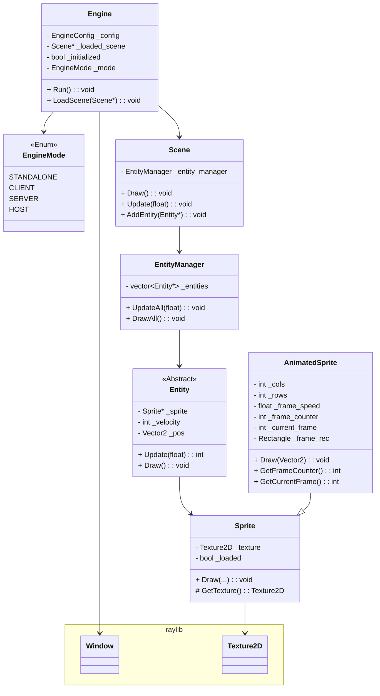

```mermaid
classDiagram

namespace raylib {
  class Window 
  class Texture2D
}

class EngineMode {
    STANDALONE
    CLIENT
    SERVER
    HOST
}

<<Enum>> EngineMode

class Engine {
  + Run(): void
  + LoadScene(Scene*): void
  - EngineConfig _config
  - Scene* _loaded_scene
  - bool _initialized
  - EngineMode _mode
}

class Scene {
  + Draw(): void
  + Update(float): void
  + AddEntity(Entity*): void
  - EntityManager _entity_manager
}

class EntityManager {
  + UpdateAll(float): void
  + DrawAll(): void
  - vector&lt;Entity*&gt; _entities
}

class Entity {
  + Update(float): int
  + Draw(): void
  - Sprite* _sprite
  - int _velocity
  - Vector2 _pos
}

class Sprite {
  + Draw(...): void
  # GetTexture(): Texture2D
  - Texture2D _texture
  - bool _loaded
}

class AnimatedSprite {
  + Draw(Vector2): void
  + GetFrameCounter(): int
  + GetCurrentFrame(): int
  - int _cols
  - int _rows
  - float _frame_speed
  - int _frame_counter
  - int _current_frame
  - Rectangle _frame_rec
}

<<Abstract>> Entity

Engine --> Scene
Scene --> EntityManager
EntityManager --> Entity
Entity --> Sprite
AnimatedSprite --|> Sprite

Engine --> Window
Engine --> EngineMode
Sprite --> Texture2D
```
