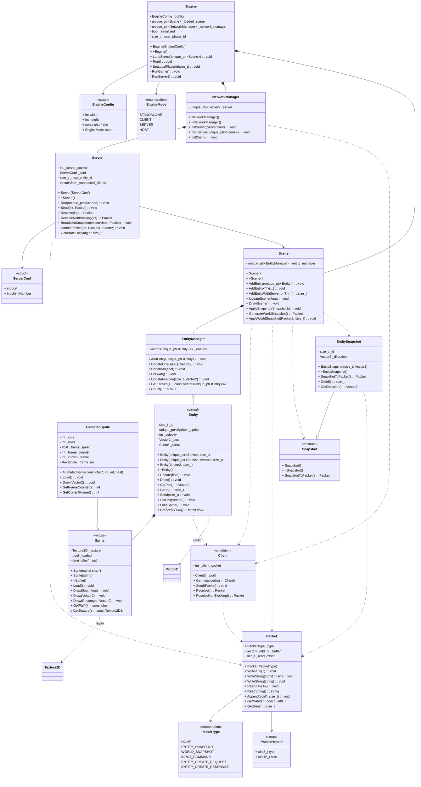

```mermaid
classDiagram

%% Enums
class EngineMode {
    <<enumeration>>
    STANDALONE
    CLIENT
    SERVER
    HOST
}

class PacketType {
    <<enumeration>>
    NONE
    ENTITY_SNAPSHOT
    WORLD_SNAPSHOT
    INPUT_COMMAND
    ENTITY_CREATE_REQUEST
    ENTITY_CREATE_RESPONSE
}

%% Core Engine
class EngineConfig {
    <<struct>>
    + int width
    + int height
    + const char* title
    + EngineMode mode
}

class Engine {
    - EngineConfig _config
    - unique_ptr~Scene~ _loaded_scene
    - unique_ptr~NetworkManager~ _network_manager
    - bool _initialized
    - size_t _local_player_id
    + Engine(EngineConfig)
    + ~Engine()
    + LoadScene(unique_ptr~Scene~): void
    + Run(): void
    + SetLocalPlayerId(size_t): void
    - RunGame(): void
    - RunServer(): void
}

%% Networking
class PacketHeader {
    <<struct>>
    + uint8_t type
    + uint16_t size
}

class Packet {
    + PacketType _type
    - vector~uint8_t~ _buffer
    - size_t _read_offset
    + Packet(PacketType)
    + Write~T~(T): void
    + WriteString(const char*): void
    + WriteString(string): void
    + Read~T~(T&): void
    + ReadString(): string
    + Append(void*, size_t): void
    + GetData(): const uint8_t*
    + GetSize(): size_t
}

class Client {
    <<singleton>>
    - int _client_socket
    - Client(int port)
    + GetInstance(int): Client&
    + Send(Packet): void
    + Receive(): Packet
    + ReceiveNonBlocking(): Packet
}

class ServerConf {
    <<struct>>
    + int port
    + int clientNumber
}

class Server {
    - int _server_socket
    - ServerConf _conf
    - size_t _next_entity_id
    - vector~int~ _connected_clients
    + Server(ServerConf)
    + ~Server()
    + Run(unique_ptr~Scene~): void
    + Send(int, Packet): void
    + Receive(int): Packet
    + ReceiveNonBlocking(int): Packet
    + BroadcastSnapshot(vector~int~, Packet): void
    + HandlePacket(int, Packet&, Scene*): void
    + GenerateEntityId(): size_t
}

class NetworkManager {
    - unique_ptr~Server~ _server
    + NetworkManager()
    + ~NetworkManager()
    + InitServer(ServerConf): void
    + RunServer(unique_ptr~Scene~): void
    + InitClient(): void
}

%% Scene & Entities
class Scene {
    - unique_ptr~EntityManager~ _entity_manager
    + Scene()
    + ~Scene()
    + AddEntity(unique_ptr~Entity~): void
    + AddEntity~T~(...): void
    + AddEntityWithServerId~T~(...): size_t
    + UpdateScene(float): void
    + DrawScene(): void
    + ApplySnapshot(Snapshot&): void
    + GenerateWorldSnapshot(): Packet
    + ApplyWorldSnapshot(Packet&, size_t): void
}

class EntityManager {
    - vector~unique_ptr~Entity~~~ _entities
    + AddEntity(unique_ptr~Entity~): void
    + UpdateOne(size_t, Vector2): void
    + UpdateAll(float): void
    + DrawAll(): void
    + UpdatePosition(size_t, Vector2): void
    + GetEntities(): const vector~unique_ptr~Entity~~&
    + Count(): size_t
}

class Entity {
    <<virtual>>
    - size_t _id
    - unique_ptr~Sprite~ _sprite
    - int _velocity
    - Vector2 _pos
    - Client* _client
    + Entity(unique_ptr~Sprite~, size_t)
    + Entity(unique_ptr~Sprite~, Vector2, size_t)
    + Entity(Vector2, size_t)
    + ~Entity()
    + Update(float): void
    + Draw(): void
    + GetPos(): Vector2
    + GetId(): size_t
    + SetId(size_t): void
    + SetPos(Vector2): void
    + LoadSprite(): void
    + GetSpritePath(): const char*
}

%% Sprites
class Sprite {
    <<virtual>>
    - Texture2D _texture
    - bool _loaded
    - const char* _path
    + Sprite(const char*)
    + Sprite(string)
    + ~Sprite()
    + Load(): void
    + Draw(float, float): void
    + Draw(Vector2): void
    + Draw(Rectangle, Vector2): void
    + GetPath(): const char*
    # GetTexture(): const Texture2D&
}

class AnimatedSprite {
    - int _cols
    - int _rows
    - float _frame_speed
    - int _frame_counter
    - int _current_frame
    - Rectangle _frame_rec
    + AnimatedSprite(const char*, int, int, float)
    + Load(): void
    + Draw(Vector2): void
    + GetFrameCounter(): int
    + GetCurrentFrame(): int
}

%% Replication
class Snapshot {
    <<abstract>>
    + Snapshot()
    + ~Snapshot()
    + SnapshotToPacket(): Packet
}

class EntitySnapshot {
    - size_t _id
    - Vector2 _direction
    + EntitySnapshot(size_t, Vector2)
    + ~EntitySnapshot()
    + SnapshotToPacket(): Packet
    + GetId(): size_t
    + GetDirection(): Vector2
}

%% Relationships - Core
Engine --> EngineConfig
Engine --> EngineMode
Engine *-- NetworkManager
Engine *-- Scene

%% Relationships - Networking
NetworkManager *-- Server
NetworkManager ..> Client
Server --> ServerConf
Server ..> Packet
Server --> Scene
Client ..> Packet
Packet --> PacketType
Packet --> PacketHeader

%% Relationships - Scene
Scene *-- EntityManager
Scene ..> Client
Scene ..> Packet
Scene ..> Snapshot
EntityManager o-- Entity

%% Relationships - Entity & Sprite
Entity *-- Sprite
Entity ..> Client
AnimatedSprite --|> Sprite

%% Relationships - Replication
EntitySnapshot --|> Snapshot
EntitySnapshot ..> Packet
Scene ..> EntitySnapshot

%% External dependencies
Sprite ..> Texture2D : raylib
Entity ..> Vector2 : raylib
```
